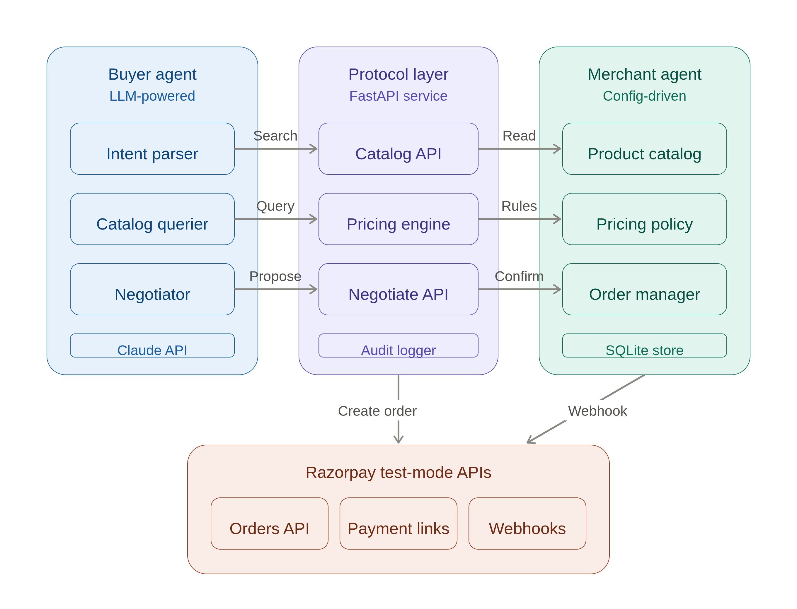
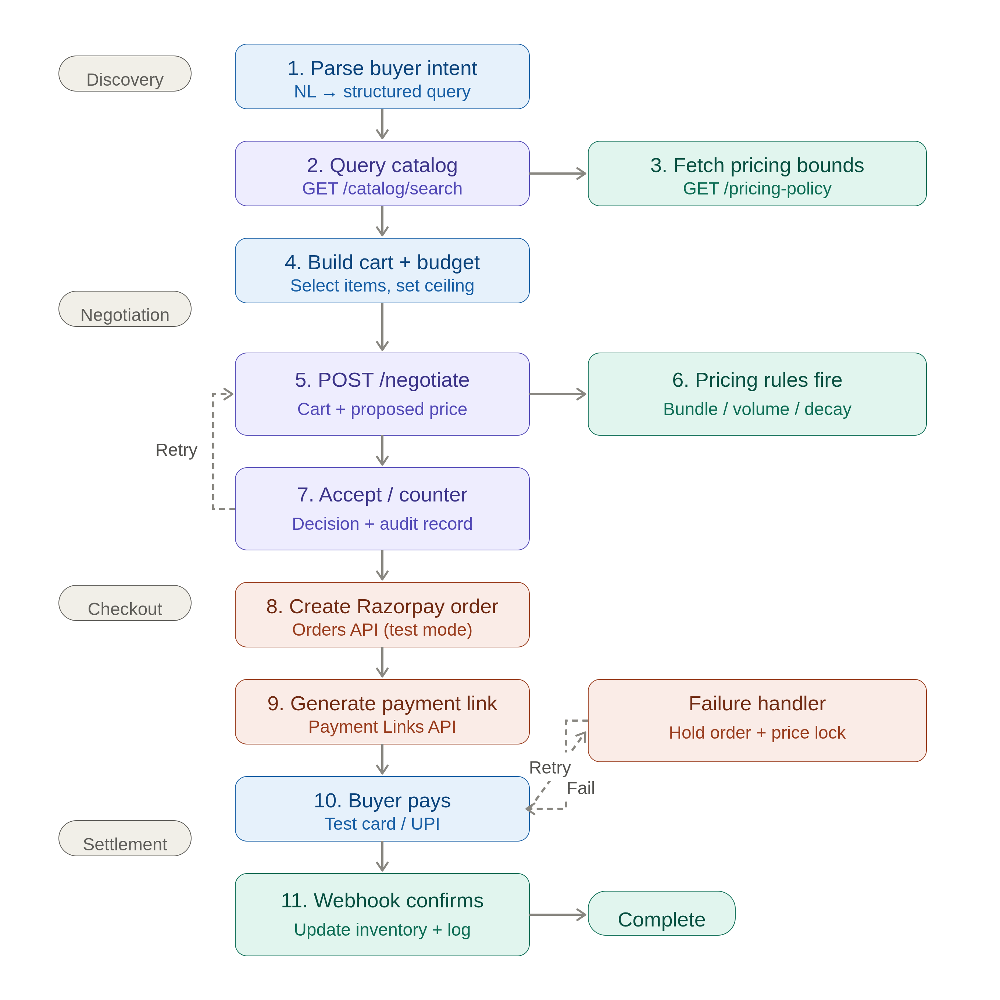
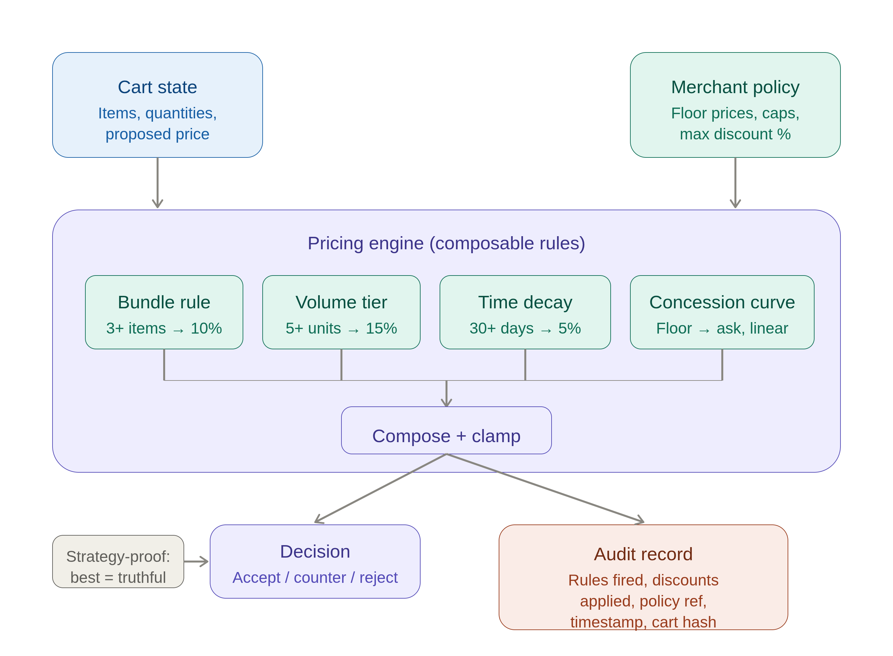

# MerchantAgent — Agentic Commerce on Razorpay

An end-to-end demo where an AI buyer agent discovers products from a merchant's structured catalog, negotiates a price within merchant-defined rules, and completes checkout via Razorpay test-mode APIs — with no human in the loop. Every pricing decision and payment action is logged in an audit trail.

**Razorpay AI Buildathon 2026 — Track 01: AI Growth & Agentic Commerce**

## How it works

1. Buyer agent receives a shopping task (e.g., "Buy 5 cotton kurtas under ₹4000")
2. Agent searches the catalog using natural language
3. Pricing engine evaluates merchant-defined rules (bundle, volume, time decay)
4. Agent negotiates price — up to 3 rounds of counter-offers
5. Razorpay order created, payment processed (test mode)
6. Full audit trail captures every decision, rule fired, and payment attempt

## Quick start

```bash
# Clone and setup
cd merchantagent
python3 -m venv venv && source venv/bin/activate
pip install -r requirements.txt

# Configure API keys
cp .env.example .env
# Edit .env with your Razorpay test keys and Anthropic API key

# Run tests
pytest tests/ -v

# Start server
uvicorn src.main:app --reload --port 8000

# Run demo (in another terminal)
python demo/run_demo.py

# Open dashboard
# http://localhost:8000/dashboard
```

## Environment variables

| Variable | Description |
|---|---|
| `RAZORPAY_KEY_ID` | Razorpay test mode key ID (`rzp_test_...`) |
| `RAZORPAY_KEY_SECRET` | Razorpay test mode key secret |
| `ANTHROPIC_API_KEY` | Claude API key for buyer agent and catalog search |
| `WEBHOOK_SECRET` | Razorpay webhook secret (optional for local dev) |

## Architecture

<p align="center">
  
</p>

Three zones: the **buyer agent** (LLM-powered) discovers and negotiates,
the **protocol layer** (FastAPI) enforces pricing rules and logs every decision,
and the **merchant agent** (config-driven) holds catalog, pricing policy, and order state.
Razorpay test-mode APIs handle the actual money movement at the bottom.

## Transaction flow

<p align="center">
  
</p>

The full lifecycle of a single purchase — from the buyer agent parsing a shopping task
to payment confirmation. The negotiation loop (steps 5–7) can cycle up to 3 rounds.
If payment fails, the system holds the order with a price lock and retries before expiring.
Every step produces an audit record.

## Pricing engine

<p align="center">
  
</p>

The pricing engine takes two inputs — the buyer's cart and the merchant's policy —
and runs them through composable discount rules (bundle, volume, time decay, concession curve).
Discounts stack additively and are clamped to the merchant's maximum cap.
Every invocation produces both a decision (accept, counter, or reject) and a full audit record
tracing which rules fired and what policy authorized the final price.
```
Buyer Agent (Claude)
    │
    ├── GET /catalog/search    →  LLM-powered filter extraction
    ├── GET /pricing-policy    →  Merchant's discount rules
    ├── POST /negotiate        →  Rule-based pricing engine
    ├── POST /checkout         →  Razorpay Orders + Payment Links API
    └── GET /orders/{id}       →  Order status polling
                                      │
                              POST /webhook  ←  Razorpay webhook
```

### Pricing rules

- **Bundle discount**: 10% off for 3+ distinct products
- **Volume tier**: 8% at 5+ items, 15% at 10+ items
- **Time decay**: 5% off products listed 30+ days ago
- **Concession**: Merchant moves 30% toward floor each negotiation round
- **Max discount cap**: 25% total, hard floor at 65% of base price

### Live dashboard

Single-file HTML dashboard at `/dashboard` — connects via Server-Sent Events to show the agent transaction in real-time. Dark theme, chat-style conversation panel, scrolling audit trail, and order status pipeline.

## Project structure

```
merchantagent/
├── src/
│   ├── main.py                # FastAPI app + SSE endpoint
│   ├── catalog/               # Product catalog (JSON-backed)
│   ├── pricing/               # Rule engine + negotiation
│   ├── checkout/              # Razorpay integration + order lifecycle
│   ├── audit/                 # SQLite audit log + SSE broadcast
│   └── buyer_agent/           # Claude-powered shopping agent
├── data/                      # Seed catalog + pricing policy
├── demo/                      # End-to-end demo script
├── frontend/                  # Live dashboard (vanilla HTML/JS)
└── tests/                     # Pricing engine + checkout tests
```

## Tech stack

- Python 3.11+ / FastAPI / uvicorn
- Razorpay Python SDK (test mode)
- Anthropic Claude API (buyer agent + catalog search)
- SQLite (audit log + order state)
- Vanilla HTML/CSS/JS (dashboard, no build step)
